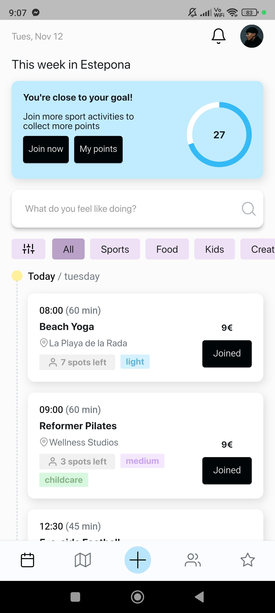

# TownSquare

## Description

A mobile and webapp that makes it easy for users to have a
super fun life in the town they live in.

[Visit Website](https://town-square-efb7b.web.app/)

## 🌟 Features

- View today's activities
- Filter activities by category
- Join an activity

---

- 🔄 **State Management**: Using **Flutter BLoC** for efficient and scalable state management.
- 🎨 **SVG Icons**: All icons are SVG-based for better design flexibility and scalability.
- 🏗️ **Clean Architecture**: Organized code with a layered structure for maintainability and testability.
- 📶 **Firebase Hosting**: Deployed using Firebase Hosting for fast and reliable web hosting.

## 📦 Packages Used

Here are the packages integrated into the project:

- **svg_flutter**: ^0.0.1
- **simple_circular_progress_bar**: ^1.0.2
- **percent_indicator**: ^4.2.4
- **get_it**: ^8.0.2
- **flutter_bloc**: ^8.1.6
- **shimmer**: ^3.0.0
- **shared_preferences**: ^2.2.3
- **responsive_sizer**: ^3.3.1
- **responsive_framework**: ^1.5.1
- **firebase_core**: ^3.4.0
- **iconify_flutter**: ^0.0.7
- **timelines_plus**: ^1.0.3

## 🛠️ Installation

1. Clone this repository:
   ```bash
   git clone https://github.com/KyleReginaldo/TownSquare.git
   ```

## 📱 Mobile View

<div style="display: flex; justify-content: space-between;">
    <div>
        <p>Home</p>
        
    </div>
    <div>
        <p>Joined</p>
        
    </div>
    <div>
        <p>Unjoin</p>
        
    </div>
    <div>
        <p>Empty</p>
        
    </div>
    <div>
        <p>In Progress</p>
        
    </div>
</div>

## 💻 Web View

<div style="display: flex; justify-content: space-between;">
    <div>
        <p>Home</p>
        
    </div>
    <div>
        <p>Joined</p>
        
    </div>
    <div>
        <p>Unjoin</p>
        
    </div>
    <div>
        <p>Empty</p>
        
    </div>
    <div>
        <p>In Progress</p>
        
    </div>
  
</div>
