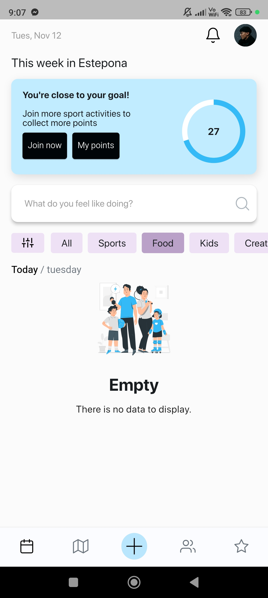
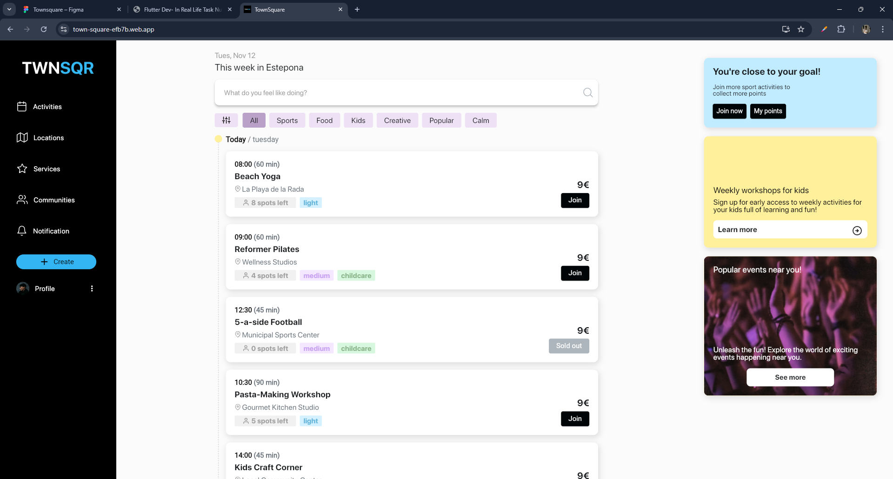
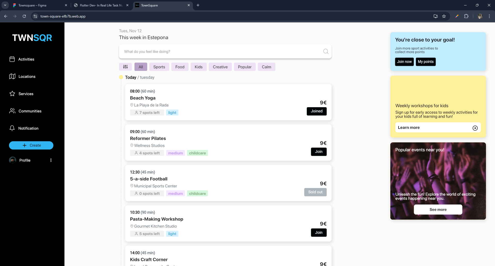

# TownSquare

## Description

A mobile and webapp that makes it easy for users to have a
super fun life in the town they live in.

[Visit Website](https://town-square-efb7b.web.app/)

## 🌟 Features

- View today's activities
- Filter activities by category
- Join an activity

## 📱 Mobile View

    

        
Home

        
    

    

        
Joined

        
    

    

        
Unjoin

        
    

    

        
Empty

        
    

    

        
In Progress

        
    

## 💻 Web View

    

        
Home

        
    

    

        
Joined

        
    

    

        
Unjoin

        
    

    

        
Empty

        
    

    

        
In Progress

        
    

  

